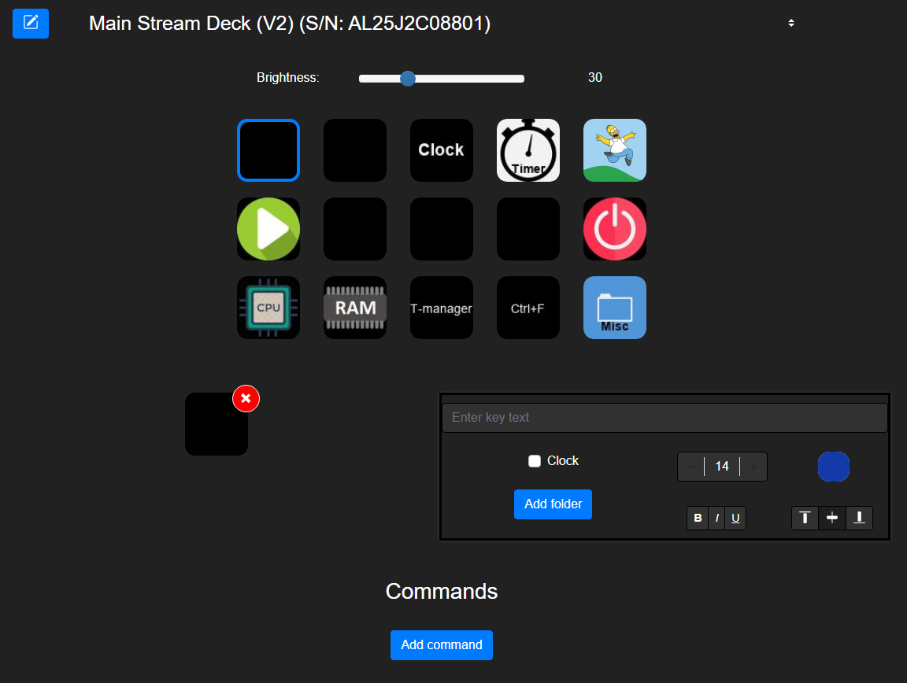
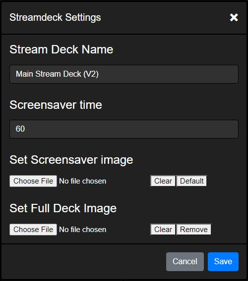
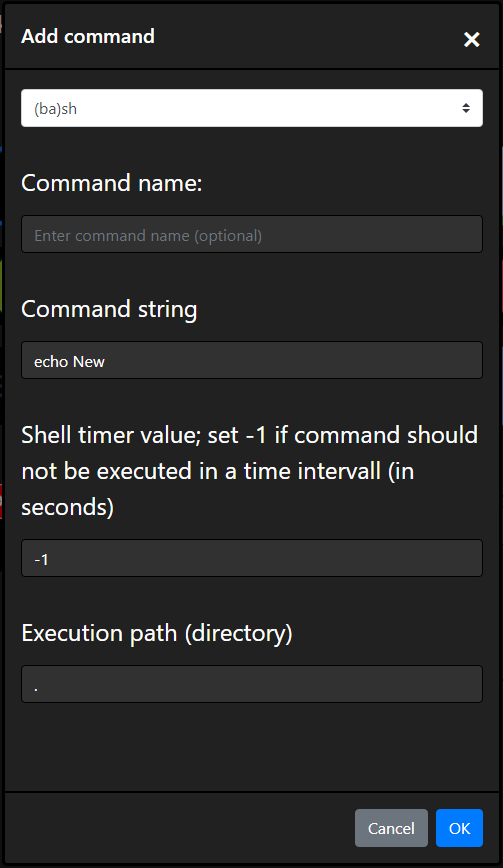

## General Information

### Starting the Django server

After everything is installed the software can be run via the run.sh script which starts the virtual environment and the Django server (this is not needed when running the docker image). The script is located in the source folder of this repository.
If no arguments are given the django server can only be accessed on the host machine. With the "network" argument i.e. <code>./run.sh network</code> the django server can be accessed through the adress 'ip4-adress-of-host-machine':8000 on the local network.

If you don't want to or can't use the GUI you can use the REST API.

### Commands

Commands are executed when pressing the stream deck keys and one stream deck key can have several commands which will then be executed after one another. There are four different command types:

* Shell commands: executes a given string in the shell in a given execution path. The shell command can also be executed in a given intervall time. The result of every executen will then be displayed as text on the corresponding key. 
* Hotkeys: simulates a given combination of key presses e.g. "ctrl+f" or "ctrl+shift+esc"
* Timer: Timer which counts down from a given start value to 0. The current time can be seen on the stream deck key
* Stopwatch: Counts upwards in seconds. The time is displayed on the stream deck key as well.

## GUI Usage

  

The GUI can be separated into 4 parts:
* Stream Deck settings
* Button display
* Button settings
* Command section

### Stream Deck settings
At the top you can see the currently selected Stream Deck with its serial number. Right beneath it the brightness of the stream deck can be set in a range of 0 to 100. The modify button on the left of the stream deck name opens the deck settings modula.  
<br>


There you can change the following things:
* Stream Deck name
* Time until the screensaver starts
* Screensaver image
* The full deck image

By setting a full deck image one image will be shown over all keys. The images of the single keys will only be shown when the full deck image gets removed.

### Button display

All buttons are displayed with their images and fonts like they would look like on the stream deck. The navigation through the folders can be done with double-clicking the corresponding keys.

### Button settings

The button settings are always shown for the selected key of the button display. Clicking on the image on the left will open a modula to change the key image via file upload.  
On the right site the style settings of the stream deck key text can be costumized. By ticking the clock option the stream deck key will show the current time until the clock option is unset. The "Add folder" button adds a folder which can be opened through this key.

### Command section

Here the commands, which will be executed by pressing the stream deck keys, can be added, modified and deleted. The commands can also be run by clicking the 'Run Commands' button. The 'add-command' button opens a modula in which all parameter for a new command can be set.
  

## Documentation of the REST API

- adopted from https://gist.github.com/azagniotov/a4b16faf0febd12efbc6c3d7370383a6

------------------------------------------------------------------------------------------

Listing stream decks, stream deck keys, folders and commands as json string

<details>

<summary markdown="span">
<code>GET</code><code><b>/api/streamdecks</b></code> returns all stream decks
</summary>

Parameters

None

Responses

> | http code     | content-type                      | response                                                            |
> |---------------|-----------------------------------|---------------------------------------------------------------------|
> | `200`         | `application/json`                | json string                                                         |

Example cURL

> ```javascript
>  curl -X GET -H "Content-Type: application/json" http://localhost:8000/api/streamdecks
> ```
</details>


<details>
<summary markdown="span"><code>GET</code><code><b>/api/streamdecks/{id}</b></code> get stream deck by its id</summary>


URL Parameters

> | name              |  type     | data type      | description                         |
> |-------------------|-----------|----------------|-------------------------------------|
> | `id`              |  required | int            | The specific stream deck id         |

Responses

> | http code     | content-type                      | response                                                            |
> |---------------|-----------------------------------|---------------------------------------------------------------------|
> | `200`         | `application/json`                | json string                                                         |
> | `404`         | `text/html; charset=utf-8`        | `Stream deck with id {id} not found`                                |

Example cURL

> ```javascript
>  curl -X GET -H "Content-Type: application/json" http://localhost:8000/api/streamdecks/1
> ```

</details>

<details>
<summary markdown="span"><code>GET</code><code><b>/api/streamdecks/{id}/folders</b></code> get folders of stream deck</summary>


URL Parameters

> | name              |  type     | data type      | description                         |
> |-------------------|-----------|----------------|-------------------------------------|
> | `id`              |  required | int            | The specific stream deck id         |

Responses

> | http code     | content-type                      | response                                                            |
> |---------------|-----------------------------------|---------------------------------------------------------------------|
> | `200`         | `application/json`                | json string                                                         |
> | `404`         | `text/html; charset=utf-8`        | `Stream deck with id {id} not found`                                |

Example cURL

> ```javascript
>  curl -X GET -H "Content-Type: application/json" http://localhost:8000/api/streamdecks/1/folders
> ```

</details>

<details>
<summary markdown="span"><code>GET</code><code><b>/api/streamdecks/{id}/folders/{folder_id}</b></code> get folder of stream deck by its folder id</summary>


URL Parameters

> | name              |  type     | data type      | description                         |
> |-------------------|-----------|----------------|-------------------------------------|
> | `id`              |  required | int            | The specific stream deck id         |
> | `folder_id`       |  required | int            | The specific folder id              |

Responses

> | http code     | content-type                      | response                                                            |
> |---------------|-----------------------------------|---------------------------------------------------------------------|
> | `200`         | `application/json`                | json string                                                         |
> | `404`         | `text/html; charset=utf-8`        | `Stream deck with id {id} not found`                                |
> | `404`         | `text/html; charset=utf-8`        | `Folder with id {folder_id} not found`                              |

Example cURL

> ```javascript
>  curl -X GET -H "Content-Type: application/json" http://localhost:8000/api/streamdecks/1/folders/1
> ```

</details>

<details>
<summary markdown="span"><code>GET</code><code><b>/api/key/{id}</b></code> get stream deck key by its id</summary>


URL Parameters

> | name              |  type     | data type      | description                         |
> |-------------------|-----------|----------------|-------------------------------------|
> | `id`              |  required | int            | The specific key id                 |

Responses

> | http code     | content-type                      | response                                                            |
> |---------------|-----------------------------------|---------------------------------------------------------------------|
> | `200`         | `application/json`                | json string                                                         |
> | `404`         | `text/html; charset=utf-8`        | `Stream deck key with id {id} not found`                                |

Example cURL

> ```javascript
>  curl -X GET -H "Content-Type: application/json" http://localhost:8000/api/key/1
> ```

</details>

<details>
<summary markdown="span"><code>GET</code><code><b>/api/key/{id}/command/{command_id}</b></code> get command of a stream deck key by its id</summary>


URL Parameters

> | name              |  type     | data type      | description                         |
> |-------------------|-----------|----------------|-------------------------------------|
> | `id`              |  required | int            | The specific key id                 |
> | `command_id`      |  required | int            | The specific command id             |

Responses

> | http code     | content-type                      | response                                                            |
> |---------------|-----------------------------------|---------------------------------------------------------------------|
> | `200`         | `application/json`                | json string                                                         |
> | `404`         | `text/html; charset=utf-8`        | `Stream deck key with id {id} not found`                            |
> | `404`         | `text/html; charset=utf-8`        | `Command with id {id} not found under this stream deck key`         |

Example cURL

> ```javascript
>  curl -X GET -H "Content-Type: application/json" http://localhost:8000/api/key/1/command/1
> ```

</details>

<details>
<summary markdown="span"><code>GET</code><code><b>/api/key/{id}/run_commands</b></code> run commands of the stream deck key</summary>


URL Parameters

> | name              |  type     | data type      | description                         |
> |-------------------|-----------|----------------|-------------------------------------|
> | `id`              |  required | int            | The specific key id                 |

Responses

> | http code     | content-type                      | response                                                            |
> |---------------|-----------------------------------|---------------------------------------------------------------------|
> | `200`         | `application/json`                | json string                                                         |
> | `404`         | `text/html; charset=utf-8`        | `Stream deck key with id {id} not found`                            |

Example cURL

> ```javascript
>  curl -X GET -H "Content-Type: application/json" http://localhost:8000/api/key/1/run_commands
> ```

</details>

<details>
<summary markdown="span"><code>GET</code><code><b>/api/key/{id}/image</b></code> get rendered image of key</summary>


URL Parameters

> | name              |  type     | data type      | description                         |
> |-------------------|-----------|----------------|-------------------------------------|
> | `id`              |  required | int            | The specific key id                 |

Responses

> | http code     | content-type                      | response                                                            |
> |---------------|-----------------------------------|---------------------------------------------------------------------|
> | `200`         | `application/json`                | json string                                                         |
> | `404`         | `text/html; charset=utf-8`        | `Stream deck key with id {id} not found`                            |

Example cURL

> ```javascript
>  curl -X GET -H "Content-Type: image/jpeg" http://localhost:8000/api/key/1/image
> ```

</details>

-------------------------------------------------------------------------------------------

Uploading images or creating folders and commands

<details>
<summary markdown="span"><code>PUT</code><code><b>/api/key/{id}/image_upload</b></code> upload image to stream deck key</summary>


URL Parameters

> | name              |  type     | data type      | description                         |
> |-------------------|-----------|----------------|-------------------------------------|
> | `id`              |  required | int            | The specific key id                 |

Data Parameters

> | name              |  type     | data type      | description                         |
> |-------------------|-----------|----------------|-------------------------------------|
> | `image_source`    |  required | request.data   | the image itself                    |

Responses

> | http code     | content-type                      | response                                                            |
> |---------------|-----------------------------------|---------------------------------------------------------------------|
> | `200`         | `text/html; charset=utf-8`        | `Image uploaded successfully`                                       |
> | `404`         | `text/html; charset=utf-8`        | `Stream deck key with id {id} not found`                            |

Example cURL

> ```javascript
>  curl -X PUT -F "image_source=@/path/to/image.png" http://localhost:8000/api/key/1/image_upload 
> ```
</details>

<details>
<summary markdown="span"><code>PUT</code><code><b>/api/streamdecks/{id}/image_upload</b></code> upload image to stream deck</summary>


URL Parameters

> | name              |  type     | data type      | description                         |
> |-------------------|-----------|----------------|-------------------------------------|
> | `id`              |  required | int            | The specific stream deck id                 |

Data Parameters

> | name              |  type     | data type      | description                         |
> |-------------------|-----------|----------------|-------------------------------------|
> | `full_deck_image`    |  required | request.data   | the image itself                    |

Responses

> | http code     | content-type                      | response                                                            |
> |---------------|-----------------------------------|---------------------------------------------------------------------|
> | `200`         | `text/html; charset=utf-8`        | `Image uploaded successfully`                                       |
> | `404`         | `text/html; charset=utf-8`        | `Stream deck with id {id} not found`                            |

Example cURL

> ```javascript
>  curl -X PUT -F "full_deck_image=@/path/to/image.png" http://localhost:8000/api/streamdecks/1/image_upload 
> ```
</details>

<details>
<summary markdown="span"><code>PUT</code><code><b>/api/streamdecks/{id}/screensaver_image_upload</b></code> upload screensaver image to stream deck</summary>


URL Parameters

> | name              |  type     | data type      | description                         |
> |-------------------|-----------|----------------|-------------------------------------|
> | `id`              |  required | int            | The specific stream deck id                 |

Data Parameters

> | name              |  type     | data type      | description                         |
> |-------------------|-----------|----------------|-------------------------------------|
> | `screensaver_image`    |  required | request.data   | the image itself                    |

Responses

> | http code     | content-type                      | response                                                            |
> |---------------|-----------------------------------|---------------------------------------------------------------------|
> | `200`         | `text/html; charset=utf-8`        | `Image uploaded successfully`                                       |
> | `404`         | `text/html; charset=utf-8`        | `Stream deck with id {id} not found`                            |

Example cURL

> ```javascript
>  curl -X PUT -F "screensaver=@/path/to/image.png" http://localhost:8000/api/streamdecks/1/image_upload 
> ```
</details>

<details>
<summary markdown="span"><code>PUT</code><code><b>/api/key/{id}/command</b></code> add command to stream deck key</summary>


URL Parameters

> | name              |  type     | data type      | description                         |
> |-------------------|-----------|----------------|-------------------------------------|
> | `id`              |  required | int            | The specific key id                 |

Data Parameters

> | name              |  type     | data type      | description                         |
> |-------------------|-----------|----------------|-------------------------------------|
> | `name`            |  required | string         | name of the command                 |
> | `command_string`  |  optional | string         | to be executed command string       |
> | `active_directory`|  optional | string         | directory path where the command should be executed                 |
> | `command_type`    |  optional | string         | type of command (default shell)     |
> | `time_value`      |  optional | int            | value required for timer and intervall shell function     |
> | `hotkeys`         |  optional | json array     | required for hotkey commands; array of keyboard keys                 |

Responses

> | http code     | content-type                      | response                                                            |
> |---------------|-----------------------------------|---------------------------------------------------------------------|
> | `200`         | `application/json`                | None                                                                |
> | `400`         | `text/html; charset=utf-8`        | `Command type not valid`                                            |
> | `404`         | `text/html; charset=utf-8`        | `Stream deck key with id {id} not found`                            |

Example cURLs

> ```javascript
>  curl -X PUT -H "Content-Type: application/json" -d "{ "name":"echo", "command_string":"echo new", "command_type":"shell"}" http://localhost:8000/api/key/1/command
>  curl -X PUT -H "Content-Type: application/json" -d "{ "name":"stopwatch", "command_type":"stopwatch"}" http://localhost:8000/api/key/2/command
>  curl -X PUT -H "Content-Type: application/json" -d "{ "name":"timer", "command_type":"timer", "time_value":"60"}" http://localhost:8000/api/key/3/command
>  curl -X PUT -H "Content-Type: application/json" -d "{ "name":"strg+f", "command_type":"hotkey", "hotkeys":[{"key1": {"key":"Control", "location":1}}, {"key2": {"key":"f", "location":0}}]}" http://localhost:8000/api/key/4/command
> ```
</details>

<details>
<summary markdown="span"><code>PUT</code><code><b>/api/key/{id}/folder</b></code> creates a new folder reachable through a stream deck key</summary>


URL Parameters

> | name              |  type     | data type      | description                         |
> |-------------------|-----------|----------------|-------------------------------------|
> | `id`              |  required | int            | The specific key id                 |

Data Parameters

> | name              |  type     | data type      | description                         |
> |-------------------|-----------|----------------|-------------------------------------|
> | `name`            |  required | string         | folder name                         |

Responses

> | http code     | content-type                      | response                                                            |
> |---------------|-----------------------------------|---------------------------------------------------------------------|
> | `200`         | `application/json`                | None                                                                |
> | `403`         | `text/html; charset=utf-8`        | `This stream deck key already leads to a folder!`                   |
> | `404`         | `text/html; charset=utf-8`        | `Stream deck key with id {id} not found`                            |

Example cURL

> ```javascript
>  curl -X PUT -H "Content-Type: application/json" -d "{ "name":"work_folder"}" http://localhost:8000/api/key/1/folder
> ```
</details>

-------------------------------------------------------------------------------------------

Modifying stream decks, stream deck keys and commands

<details>
<summary markdown="span"><code>PATCH</code><code><b>/api/streamdecks/{id}</b></code> change name and/or brightness of stream deck</summary>


URL Parameters

> | name              |  type     | data type      | description                         |
> |-------------------|-----------|----------------|-------------------------------------|
> | `id`              |  required | int            | The specific stream deck id         |

Data Parameters

> | name              |  type     | data type      | description                         |
> |-------------------|-----------|----------------|-------------------------------------|
> | `name`            |  optional | string         |  name of the stream deck            |
> | `brightness`      |  optional | int            |  brightness value (0-100)           |
> | `screensaver_time`|  optional | int            |  time until screensaver starts (0 - 86400 seconds)           |

Responses

> | http code     | content-type                      | response                                                            |
> |---------------|-----------------------------------|---------------------------------------------------------------------|
> | `200`         | `application/json`                | `json string`                                                       |
> | `404`         | `text/html; charset=utf-8`        | `Stream deck with id {id} not found`                                |

Example cURL

> ```javascript
>  curl -X PUT -H "Content-Type: application/json" -d "{ "brightness":"100"}" http://localhost:8000/api/streandecks/1
> ```
</details>

<details>
<summary markdown="span"><code>PATCH</code><code><b>/api/key/{id}</b></code> change the text of the stream deck key</summary>


URL Parameters

> | name              |  type     | data type      | description                         |
> |-------------------|-----------|----------------|-------------------------------------|
> | `id`              |  required | int            | The specific stream deck key id     |

Data Parameters

> | name              |  type     | data type      | description                         |
> |-------------------|-----------|----------------|-------------------------------------|
> | `text`            |  optional | string         |  text of stream deck key            |
> | `clock`           |  optional | int            |  1 if key should show a clock       |
> | `text_size`       |  optional | int            |  size of text                       |
> | `text_position`   |  optional | string         |  text position (top, center, bottom)|
> | `text_color`      |  optional | string         |  text color as hex value            |
> | `bold`            |  optional | bool           |  true for bold text                 |
> | `italic`          |  optional | bool           |  true of italic text                |
> | `underlined`      |  optional | bool           |  true for underlined text           |

Responses

> | http code     | content-type                      | response                                                            |
> |---------------|-----------------------------------|---------------------------------------------------------------------|
> | `200`         | `application/json`                | `json string`                                                       |
> | `404`         | `text/html; charset=utf-8`        | `Stream deck key with id {id} not found`                            |
> | `422`         | `text/html; charset=utf-8`        | `Color string is invalid`                                           |
> | `422`         | `text/html; charset=utf-8`        | `Text position value is invalid`                                    |

Example cURL

> ```javascript
>  curl -X PUT -H "Content-Type: application/json" -d "{ "text":"test"}" http://localhost:8000/api/key/1
> ```

</details>

<details>
<summary markdown="span"><code>PATCH</code><code><b>/api/key/{id}/command/{command_id}</b></code> change command of stream deck key</summary>


URL Parameters

> | name              |  type     | data type      | description                         |
> |-------------------|-----------|----------------|-------------------------------------|
> | `id`              |  required | int            | The specific key id                 |
> | `command_id`      |  required | int            | The specific command id             |

Data Parameters

> | name              |  type     | data type      | description                         |
> |-------------------|-----------|----------------|-------------------------------------|
> | `name`            |  optional | string         | name of the command                 |
> | `command_string`  |  optional | string         | to be executed command string       |
> | `active_directory`|  optional | string         | directory path where the command should be executed                 |
> | `command_type`    |  optional | string         | type of command (default shell)     |
> | `time_value`      |  optional | int            | value required for timer and intervall shell command function     |
> | `hotkeys`         |  optional | json array         | required for hotkey commands; array of keyboard keys                 |

Responses

> | http code     | content-type                      | response                                                            |
> |---------------|-----------------------------------|---------------------------------------------------------------------|
> | `200`         | `application/json`                | `json string`                                                       |
> | `404`         | `text/html; charset=utf-8`        | `Command with id {id} not found under this stream deck key`         |
> | `404`         | `text/html; charset=utf-8`        | `Stream deck key with id {id} not found`                            |

Example cURL

> ```javascript
>  curl -X PATCH -H "Content-Type: application/json" -d "{ "name":"changed_name"}" http://localhost:8000/api/key/1/command/1
> ```
</details>

-------------------------------------------------------------------------------------------

Deleting images, folders and commands

<details>
<summary markdown="span"><code>DELETE</code><code><b>/api/streamdecks/{id}/image_delete</b></code> delete image of stream deck</summary>


URL Parameters

> | name              |  type     | data type      | description                         |
> |-------------------|-----------|----------------|-------------------------------------|
> | `id`              |  required | int            | The specific stream deck id     |

Responses

> | http code     | content-type                      | response                                                            |
> |---------------|-----------------------------------|---------------------------------------------------------------------|
> | `204`         | `text/html; charset=utf-8`        | `Image deleted successfully`                                       |
> | `404`         | `text/html; charset=utf-8`        | `Stream deck with id {id} not found`                            |

Example cURL

> ```javascript
>  curl -X DELETE http://localhost:8000/api/streamdecks/1/image_delete
> ```
</details>

<details>
<summary markdown="span"><code>DELETE</code><code><b>/api/streamdecks/{id}/screensaver_image_delete</b></code> delete screensaver image of stream deck</summary>


URL Parameters

> | name              |  type     | data type      | description                         |
> |-------------------|-----------|----------------|-------------------------------------|
> | `id`              |  required | int            | The specific stream deck id     |

Responses

> | http code     | content-type                      | response                                                            |
> |---------------|-----------------------------------|---------------------------------------------------------------------|
> | `204`         | `text/html; charset=utf-8`        | `Image deleted successfully`                                       |
> | `404`         | `text/html; charset=utf-8`        | `Stream deck with id {id} not found`                            |

Example cURL

> ```javascript
>  curl -X DELETE http://localhost:8000/api/streamdecks/1/image_delete
> ```
</details>
<details>
<summary markdown="span"><code>DELETE</code><code><b>/api/key/{id}</b></code> deletes image of stream deck key</summary>


URL Parameters

> | name              |  type     | data type      | description                         |
> |-------------------|-----------|----------------|-------------------------------------|
> | `id`              |  required | int            | The specific stream deck key id     |

Responses

> | http code     | content-type                      | response                                                            |
> |---------------|-----------------------------------|---------------------------------------------------------------------|
> | `204`         | `text/html; charset=utf-8`        | `Image deleted successfully`                                       |
> | `404`         | `text/html; charset=utf-8`        | `Stream deck key with id {id} not found`                            |

Example cURL

> ```javascript
>  curl -X DELETE http://localhost:8000/api/key/1
> ```
</details>
<details>
<summary markdown="span"><code>DELETE</code><code><b>/api/key/{id}/command/{command_id}</b></code> deletes command of stream deck key</summary>


URL Parameters

> | name              |  type     | data type      | description                         |
> |-------------------|-----------|----------------|-------------------------------------|
> | `id`              |  required | int            | The specific stream deck key id     |
> | `command_id`      |  required | int            | The specific command id             |

Responses

> | http code     | content-type                      | response                                                            |
> |---------------|-----------------------------------|---------------------------------------------------------------------|
> | `204`         | `text/html; charset=utf-8`        | `Command deleted successfully`                                       |
> | `400`         | `text/html; charset=utf-8`        | `Command type not valid`                                            |
> | `404`         | `text/html; charset=utf-8`        | `Command with id {id} not found under this stream deck key`         |
> | `404`         | `text/html; charset=utf-8`        | `Stream deck key with id {id} not found`                            |

Example cURL

> ```javascript
>  curl -X DELETE http://localhost:8000/api/key/1/command/1
> ```
</details>

<details>
<summary markdown="span"><code>DELETE</code><code><b>/api/key/{id}/folder</b></code> deletes the folder where this stream deck key leads to</summary>


URL Parameters

> | name              |  type     | data type      | description                         |
> |-------------------|-----------|----------------|-------------------------------------|
> | `id`              |  required | int            | The specific stream deck key id     |

Responses

> | http code     | content-type                      | response                                                            |
> |---------------|-----------------------------------|---------------------------------------------------------------------|
> | `200`         | `text/html; charset=utf-8`        | `folder deleted successfully`                                       |
> | `404`         | `text/html; charset=utf-8`        | `this stream deck key does not lead to a folder`                    |
> | `404`         | `text/html; charset=utf-8`        | `Stream deck key with id {id} not found`                            |

Example cURL

> ```javascript
>  curl -X DELETE http://localhost:8000/api/key/1/folder
> ```

</details>

-------------------------------------------------------------------------------------------